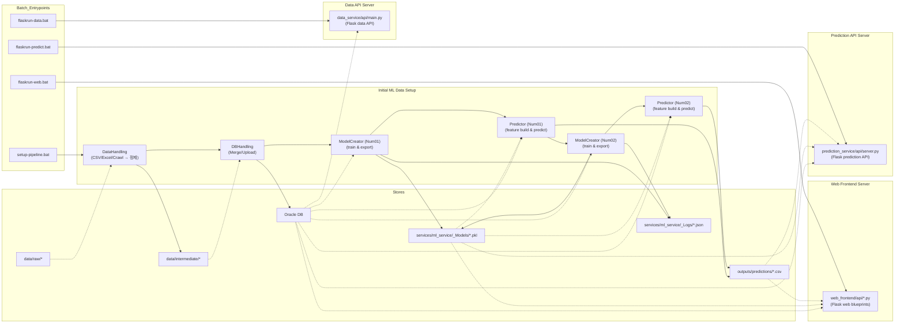
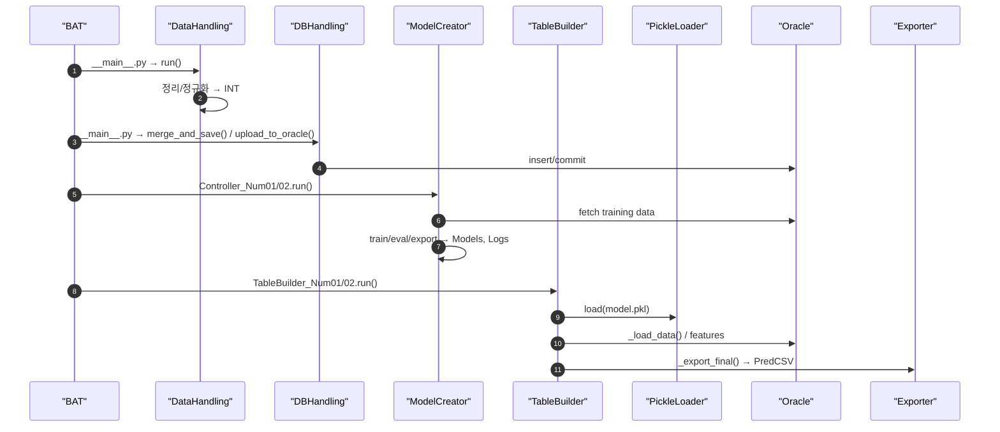

## 2차 프로젝트 - 딥러닝 & 플라스크 기반 서비스 프로젝트

### 프로젝트 명 : Generative AI 및 지능형 에이전트 기반 교육 인프라 예측 서비스

### 5조 - 강승민, 김선희

## Directory Structure
```

2nd_Project_LLM_Service/
│  
├── .venv/                     # 가상환경 폴더
├── app/                       # 플라스크 웹서버 게이트웨이
├── docs/                      # 문서 폴더
├── services/                  # 각 서비스 폴더
├── tools/                     # 프로젝트 프로그램파일 폴더
├── flaskrun-data.bat          # 플라스크 데이터서버 실행 스크립트
├── flaskrun-predict.bat       # 플라스크 예측서버 실행 스크립트
├── flaskrun-web.bat           # 플라스크 웹서버 실행 스크립트
├── requirements.txt           # 라이브러리 목록
├── setup-env.bat              # 가상환경 & DB 셋업 스크립트
└── setup-pipeline.bat         # 머신러닝 초기 데이터 셋업 스크립트

```

## Pipeline Overview



## Class Diagram

```mermaid

classDiagram
namespace generate_mermaid_uml {
  class ClassInfo__85de7b {
    +__init__()
  }
  class ImportContext__086328 {
    +__init__()
    +visit_Import()
    +visit_ImportFrom()
  }
  class V__1652f2 {
    +visit_ClassDef()
    +visit_FunctionDef()
    +visit_Assign()
    +visit_AnnAssign()
    +visit_Call()
  }
}
namespace services__core_utiles__OracleDBConnection {
  class OracleDBConnection__1526e5 {
    +__init__()
    +_init_client()
    +connect()
    +close()
    +execute_query()
  }
}
namespace data_service__DBHandling__DataMergerAndExporter {
  class DataMergerAndExporter__867b24 {
    +__init__()
    +merge_and_save()
    +upload_to_oracle()
  }
}
namespace data_service__DBHandling__FilteredScoreUploader {
  class FilteredScoreUploader__1297e9 {
    +__init__()
    +run()
  }
}
namespace data_service__DBHandling__TableMergerUploader {
  class TableMergerUploader__d5705f {
    +__init__()
    +load_and_merge_tables()
    +upload_to_oracle()
    +save_csv()
    +process_all_years()
  }
}
namespace data_service__DataHandling__CSVHeaderRenamer {
  class CSVHeaderRenamer__651d51 {
    +__init__()
    +load_mapping()
    +rename_tokens()
    +column_index_to_excel_letter()
    +process_all_csvs()
  }
}
namespace data_service__DataHandling__CSVToOracleUploader {
  class CSVToOracleUploader__ccc25f {
    +__init__()
    +run()
  }
}
namespace data_service__DataHandling__CWURCrawler {
  class CWURCrawler__9ba8f9 {
    +__init__()
    +extract_years()
    +get_cwur_url()
    +find_column_index()
    +crawl_year()
    +run()
  }
}
namespace data_service__DataHandling__EnNameCollector {
  class EnNameCollector__25976f {
    +__init__()
    +run()
  }
}
namespace data_service__DataHandling__ExcelToCSVConverter_ver1 {
  class ExcelToCSVConverter_ver1__903cef {
    +__init__()
    +detect_data_start_row()
    +build_merged_map()
    +extract_dynamic_headers()
    +count_valid_cells_in_row()
    +run()
  }
}
namespace data_service__DataHandling__ExcelToCSVConverter_ver2 {
  class ExcelToCSVConverter_ver2__754ca6 {
    +__init__()
    +build_merged_map()
    +extract_column_names()
    +detect_data_start_row()
    +detect_data_end_row()
    +extract_year_slices()
    +extract_dataframe()
    +run()
  }
}
namespace data_service__DataHandling__HeaderAbbreviationMapper {
  class HeaderAbbreviationMapper__9f73b9 {
    +__init__()
    +load_headers()
    +generate_abbreviations()
    +save_mapping_csv()
    +check_duplicate_abbreviations_from_file()
    +run()
  }
}
namespace data_service__DataHandling__HeaderTermCollector {
  class HeaderTermCollector__e51d17 {
    +__init__()
    +collect()
    +tokenize()
    +run()
    +save_terms()
  }
}
namespace data_service__DataHandling__NameMapper {
  class NameMapper__f06468 {
    +__init__()
    +run()
  }
}
namespace data_service__DataHandling__RankedScoreExporter {
  class RankedScoreExporter__e7a681 {
    +__init__()
    +run()
  }
}
namespace ml_service__ModelCreator__Cleaner {
  class DataCleaner__967cba {
    +__init__()
    +clean_numeric()
    +handle_missing()
    +handle_outliers()
  }
}
namespace ml_service__ModelCreator__Controller_Num01 {
  class PipelineController__f88464 {
    +__init__()
    +load_config()
    +setup_db_connection()
    +run()
  }
}
namespace ml_service__ModelCreator__Controller_Num02 {
  class PipelineController__9d3579 {
    +__init__()
    +setup_db_connection()
    +run()
  }
}
namespace ml_service__ModelCreator__Fetcher {
  class DataFetcher__236ad1 {
    +__init__()
    +fetch()
  }
}
namespace ml_service__ModelCreator__Handler {
  class DataHandler__44377b {
    +__init__()
    +scale_features()
    +assign_clusters()
  }
}
namespace ml_service__ModelCreator__Logger {
  class PipelineLogger__633360 {
    +__init__()
    +save_log()
  }
}
namespace ml_service__ModelCreator__ModelLoader {
  class ModelFactory__5dfde1 {
    +get_model()
  }
}
namespace ml_service__ModelCreator__Trainer {
  class ModelTrainer__5c32ad {
    +__init__()
    +train_full_model()
    +train_by_cluster()
  }
}
namespace prediction_service__Predictor__Controller {
  class Controller__415001 {
    +__init__()
    +load_config()
    +run()
  }
}
namespace prediction_service__Predictor__PickleLoader {
  class PickleLoader__1ec100 {
    +__init__()
    +load()
  }
}
namespace prediction_service__Predictor__TableBuilder_Num01 {
  class TableBuilder__17e875 {
    +__init__()
    +_get_targets()
    +_load_data()
    +predict()
    +_export_final()
    +run()
  }
}
namespace prediction_service__Predictor__TableBuilder_Num02 {
  class TableBuilder__e255d6 {
    +__init__()
    +_load_data()
    +_predict_for_year()
    +_export_final()
    +run()
  }
}
namespace prediction_service__Predictor__TableBuilder_User {
  class TableBuilderUser__aa40e7 {
    +__init__()
    +_load_user_csv()
    +_extract_user_year_data()
    +_load_library_data_csv()
    +_load_library_data_db()
    +_load_library_data()
    +_predict_df()
    +run()
    +predict()
    +predict_from_payload()
  }
}
PipelineController__f88464 --> PipelineLogger__633360 : uses
PipelineController__f88464 --> DataFetcher__236ad1 : uses
PipelineController__f88464 --> ModelTrainer__5c32ad : uses
PipelineController__f88464 --> DataHandler__44377b : uses
PipelineController__f88464 --> DataCleaner__967cba : uses
PipelineController__9d3579 --> PipelineLogger__633360 : uses
PipelineController__9d3579 --> ModelTrainer__5c32ad : uses
PipelineController__9d3579 --> DataCleaner__967cba : uses
PipelineController__9d3579 --> DataFetcher__236ad1 : uses
Controller__415001 --> OracleDBConnection__1526e5 : uses
Controller__415001 *-- OracleDBConnection__1526e5 : has
TableBuilder__17e875 --> PickleLoader__1ec100 : uses
TableBuilder__e255d6 --> PickleLoader__1ec100 : uses
TableBuilderUser__aa40e7 --> PickleLoader__1ec100 : uses

```



## Prediction Sequence Diagram



## 패키지 구동 방법

#### 1. 환경세팅

사용 파이썬 버전 : 3.11.9

오라클 DB 사용 버전 : 

오라클 클라이언트 버전 : 

#### 2. 초기환경 세팅

setup-env 실행 : 가상환경 및 오라클 테이블 스페이스 및 스키마, 초기 테이블 생성

setup-pipline 실행 : 서비스용 초기 전처리 및 머신러닝 예측 전체 진행


#### 3. 플라스크 서버 실행

flaskrun 3종 실행 : 웹서버 및 2종의 api 서버 실행

관리자 계정으로 로그인 : ID : libra_admin, PW : 1234

관리자 페이지 접속 후 데이터 초기 동기화 실행


## 프로젝트 전체 디렉토리 정보


```

2nd_Project_LLM_Service/
│  
├── .venv/ <- 가상환경 폴더
│   │
│   └── libra_env/    
│  
├── app/ <- 플라스크 서버 시작지점
│   │
│   ├── __init__.py  
│   └── main.py
│  
├── docs/ <- 문서 폴더
│   │
│   ├── diagrams/         # 다이어그램 mmd 파일 폴더    
│   └── devlogs/          # 개발노트 md 파일 폴더   
│
├── services/             # 모든 마이크로서비스 폴더 묶음
│   │
│   ├── core_utiles/                         # 공통 모듈 전용 폴더
│   │   ├── __init__.py
│   │   ├── config_loader.py                 # .env 로드 모듈
│   │   ├── Mapper.py                        # 헤더, 대학명 매핑표 모듈
│   │   ├── OracleDBConnection.py            # 오라클DBD 접속 모듈
│   │   ├── OracleSchemaBuilder.py           # 테이블 생성 시 데이터타입 보정 모듈
│   │   └── OracleTableCreater.py            # 보정 후 테이블 생성 모듈
│   │   
│   │
│   ├── data_service/                        # 데이터 수집 및 처리 서비스
│   │   │
│   │   ├── api/                             # 플라스크 api
│   │   │   │  
│   │   │   ├── data_api.py                  # 전체예측값 전달 클래스
│   │   │   ├── main.py                      # 플라스크 api서버 메인코드
│   │   │   └── num06_api.py                 # 유저서비스 데이터 전달 클래스
│   │   │
│   │   ├── DataHandling/                    # 원본파일 CSV파일화 및 DB 업로드 패키지  
│   │   │   │  
│   │   │   ├── __init__.py  
│   │   │   ├── __main__.py                  # DataHandling 패키지 실행  
│   │   │   ├── CSVHeaderRenamer.py          # 모든 컬럼 헤더 변경 클래스  
│   │   │   ├── CSVToOracleUploader.py       # 테이블 생성 클래스  
│   │   │   ├── CWURCrawler.py               # 대학 평가점수 크롤링 클래스  
│   │   │   ├── EnNameCollector.py           # 영문 대학명 리스트화 클래스  
│   │   │   ├── ExcelToCSVConverter_ver1.py  # CSV파일 변환 클래스 1  
│   │   │   ├── ExcelToCSVConverter_ver2.py  # CSV파일 변환 클래스 2  
│   │   │   ├── HeaderAbbreviationMapper.py  # 헤더 한글 영문 매핑 클래스  
│   │   │   ├── HeaderTermCollector.py       # 모든 csv파일 컬럼 별 헤더 수집 클래스  
│   │   │   ├── NameMapper.py                # 영문 대학명 한국명으로 매핑 클래스  
│   │   │   └── RankedScoreExporter.py       # 연도 별 대학 평가점수 csv 파일 생성  
│   │   │  
│   │   ├── DBHandling/                      # DB테이블 전처리 및 정규화 패키지  
│   │   │   │  
│   │   │   ├── __init__.py  
│   │   │   ├── __main__.py                  # DBHandling 패키지 실행  
│   │   │   ├── DataMergerAndExporter.py     # 병합 테이블 생성 클래스  
│   │   │   ├── FilteredScoreUploader.py     # 정규화 테이블 생성 클래스  
│   │   │   └── TableMergerUploader.py       # 데이터 병합 및 테이블 생성 클래스
│   │   │
│   │   ├── db/
│   │   │   │
│   │   │   └── DATA_DB.DBF                  # AI용 데이터베이스
│   │   |
│   │   ├── __init__.py
│   │   ├── __main__.py                      # 전체 패키지 컨트롤 메인코드
│   │   └── .env
│   │
│   ├── ml_service/                          # 모델 학습 및 튜닝
│   │   │
│   │   ├── _Configs/                        # 각 모델 설정파일 폴더
│   │   │   │
│   │   │   └── Num01_Config_XGB.json
│   │   │
│   │   ├── _Logs/                           # 각 모델 학습 로그 폴더
│   │   │   │
│   │   │   └── Num01_XGB_v1.0_Log.json
│   │   │
│   │   ├── _Models/                         # 각 모델 피클파일 폴더
│   │   │   │
│   │   │   └── Num01_XGB_full_v1.0.pkl
│   │   │
│   │   ├── ModelCreator/                    # 설정값 기반 모델 생성 패키지
│   │   │   │
│   │   │   ├── Utiles/                      # 공용 유틸 패키지
│   │   │   │   │
│   │   │   │   ├── __init__.py
│   │   │   │   ├── Evaluator.py             # 모델 평가 클래스
│   │   │   │   ├── Exporter.py              # 피클파일 저장 클래스
│   │   │   │   └── Validator.py             # 데이터 무결성 검사 클래스
│   │   │   │
│   │   │   ├── __init__.py
│   │   │   ├── __main__.py                  # 실행 트리거
│   │   │   ├── Cleaner.py                   # 이상치 & 결측치 처리 클래스
│   │   │   ├── Controller_Num01.py          # 모델 01번 실행 파이프라인 클래스
│   │   │   ├── Controller_Num02.py          # 모델 01번 실행 파이프라인 클래스
│   │   │   ├── Fetcher.py                   # 학습용 데이터 로딩 클래스
│   │   │   ├── Handler.py                   # 스케일러 & 클러스터 적용 클래스
│   │   │   ├── Logger.py                    # 학습 로그 저장 클래스
│   │   │   ├── ModelLoader.py               # 머신러닝 모델 호출 클래스
│   │   │   └── Trainer.py                   # 학습 클래스
│   │   │
│   │   ├── __init__.py
│   │   ├── __main__.py                      # 전체 패키지 컨트롤 메인코드
│   │   └── .env
│   │
│   ├── prediction_service/                  # 머신러닝 모델 예측 패키지
│   │   │
│   │   ├── api/                             # 플라스크 api
│   │   │   │  
│   │   │   ├── server.py                    # 플라스크 api서버 메인코드
│   │   │   └── user_api.py                  # api 기반 예측 파이프라인
│   │   │
│   │   ├── Predictor/                       # 예측 실행 클래스
│   │   │   │
│   │   │   ├── __init__.py
│   │   │   ├── __main__.py                  # 실행 트리거
│   │   │   ├── Controller.py                # 예측 실행 전체 파이프라인 클래스
│   │   │   ├── PickleLoader.py              # 설정값에 따른 피클파일 로딩 클래스
│   │   │   ├── TableBuilder_Num01.py        # 모델 01번 기반 예측 클래스
│   │   │   ├── TableBuilder_Num02.py        # 모델 02번 기반 예측 클래스
│   │   │   └── TableBuilder_User.py         # 유저 데이터 기반 예측 클래스
│   │   │
│   │   ├── __init__.py
│   │   ├── __main__.py                      # 전체 패키지 컨트롤 메인코드
│   │   └── .env
│   │
│   ├── user_service/                        # 유저 데이터 관리 블루프린트
│   │   │
│   │   ├── db/
│   │   │   │
│   │   │   └── USER_DB.DBF                  # 유저 데이터베이스
│   │   │
│   │   ├── .env 
│   │   ├── init_oracle_user_data.py         # 초기 유저 데이터베이스 세팅 스크립트
│   │   ├── login_manager.py                 # 로그인 유효성 검사 스크립트
│   │   ├── predict_sync.py                  # 유저 데이터 예측 블루프린트
│   │   └── user_analysis.py                 # 유저 서비스 페이지 블루프린트
│   │
│   ├── web_frontend/                        # 웹 프론트엔드
│   │   │
│   │   ├── api/                             # 플라스크 웹서버 블루프린트 폴더
│   │   │   │  
│   │   │   ├── admin_system.py              # 관리자 전용 기능제어 블루프린트
│   │   │   ├── chart_data.py                # 차트페이지 블루프린트
│   │   │   ├── Oracle_utils.py              # 오라클DB 커넥션 모듈
│   │   │   ├── profile_api.py               # 마이페이지 블루프린트
│   │   │   ├── register_api.py              # 회원가입 페이지 블루프린트
│   │   │   ├── sync.py                      # 예측데이터 api 콜 블루프린트
│   │   │   └── user_api.py                  # 유저 입력정보 api콜 플루프린트
│   │   │
│   │   ├── static/                          # css & js & image 스테틱 폴더
│   │   │   │
│   │   │   ├── css/                         # 페이지 별 css파일 폴더
│   │   │   │   │
│   │   │   │   ├── common/                  # 공통 파츠
│   │   │   │   │   │
│   │   │   │   │   └── header-footer.css    # 헤더 & 푸터 css
│   │   │   │   │
│   │   │   │   ├── admin.css                # 관리자 페이지 css
│   │   │   │   ├── chartpage1.css           # 차트페이지용 css
│   │   │   │   ├── login.css                # 로그인 페이지 css
│   │   │   │   ├── main.css                 # 메인페이지 css
│   │   │   │   ├── profile.css              # 마이페이지 css
│   │   │   │   └── register.css             # 회원가입 페이지 css
│   │   │   │
│   │   │   │
│   │   │   ├── images/                      # 이미지 리소스파일
│   │   │   │   |
│   │   │   │   ├── logo.jpeg
│   │   │   │   └── logo2.png
│   │   │   │
│   │   │   │
│   │   │   └── js/                          # 페이지 별 로직 구현 js파일 폴더
│   │   │       |
│   │   │       ├── admin.js                 # 관리자 페이지 js
│   │   │       ├── chartpage1.js            # 차트페이지 1번용 js
│   │   │       ├── chartpage2.js            # 차트페이지 2번용 js
│   │   │       ├── header.js                # 헤더 js
│   │   │       ├── main.js                  # 메인페이지 js
│   │   │       ├── profile.js               # 마이페이지 js
│   │   │       ├── register.js              # 회원가입 js
│   │   │       └── userservice.js           # 유저서비스 js
│   │   │
│   │   ├── templates/                       # 페이지 html 파일 폴더
│   │   │   │
│   │   │   ├── common/                      # 공통 파츠
│   │   │   │   |
│   │   │   │   ├── chatbot.html             # 챗봇 플로터용 html
│   │   │   │   ├── footer.html              # 푸터 html
│   │   │   │   └── header.html              # 헤더 html
│   │   │   │
│   │   │   ├── admin.html                   # 관리자 페이지 html
│   │   │   ├── chartpage1.html              # 차트페이지 1번용 html
│   │   │   ├── chartpage2.html              # 차트페이지 2번용 html
│   │   │   ├── login.html                   # 로그인 페이지 html
│   │   │   ├── main.html                    # 메인페이지 html
│   │   │   ├── profile.html                 # 마이페이지 html
│   │   │   ├── register.html                # 회원가입 html
│   │   │   └── userservice.html             # 유저서비스 html
│   │   │
│   │   └── .env 
│   │
│   └── llm_service/           # LLM 챗봇 서비스
│   
├── tools/                 # 필수유틸 폴더
│   │
│   └── instantclient-basic-windows.x64-19.25.0.0.0dbru/
│
├── flaskrun-data.bat          # 플라스크 데이터서버 실행 스크립트
├── flaskrun-predict.bat       # 플라스크 예측서버 실행 스크립트
├── flaskrun-web.bat           # 플라스크 웹서버 실행 스크립트
├── requirements.txt           # 라이브러리 목록
├── setup-env.bat              # 가상환경 & DB 셋업 스크립트
└── setup-pipeline.bat         # 머신러닝 초기 데이터 셋업 스크립트

```